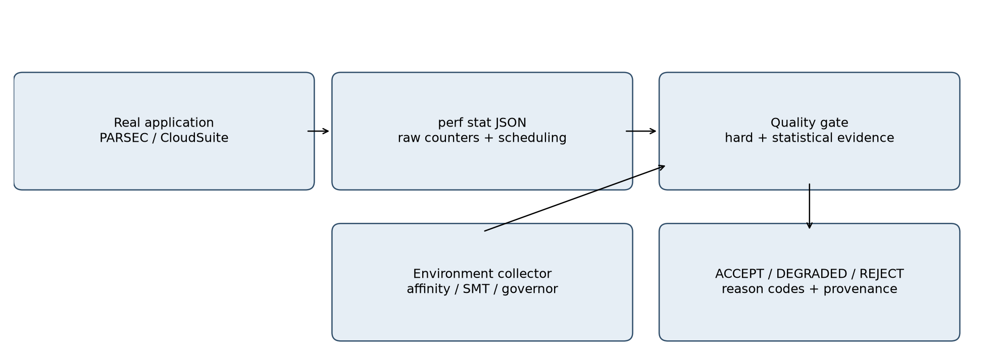

# CounterBouncer

Linux `perf stat`으로 모은 PMU 숫자가, 그 상태로 성능 진단에
넣어도 되는지 가리는 바운서입니다.

이름은 카운터 앞 바운서에서 따왔습니다. **“성능이 느려졌는가?”와
“측정을 믿을 수 있는가?”는 다른 문제입니다.** Profiler가 아니고,
병목을 찾아 주지도 않습니다.

## 무엇을 푸는 문제인가

카운터가 찍혔다는 것과 그 숫자를 믿어도 된다는 것은 별개입니다.
실행이 평소 속도로 끝났다고 해서 coverage가 충분한 것은 아니고,
coverage가 좋아도 실행 환경이 깨끗한 것은 아닙니다.

판정은 두 축입니다. 한 줄 `ACCEPT` / `DEGRADED` / `REJECT`는 접은
값입니다.

| Measurement integrity | Experiment context | 사용 |
| --- | --- | --- |
| VALID | CONTROLLED | 진단·비교에 사용 |
| VALID | CONTAMINATED | 측정은 유효, 비교는 주의 |
| INVALID | (any) | 진단에 사용하지 않음 |

## 결과

`native-holdout-v2`는 i9-14900K bare-metal에서 PARSEC native 네 개와
CloudSuite Data Caching 270회입니다. warmup 별도, 실행 실패 0.
integrity VALID 160 / INVALID 110. 접으면 ACCEPT 70, DEGRADED 90,
REJECT 110입니다. `native-holdout-v1` 225회는 다시 맞추지 않았습니다.

| 조건 | Integrity | Context | 애플리케이션 |
| --- | --- | --- | --- |
| CLEAN | 대부분 VALID | 대부분 CONTROLLED | baseline |
| MULTIPLEX | INVALID | CONTROLLED(PARSEC) | runtime ≈ CLEAN |
| SMT | VALID | CONTAMINATED | 최대 +61.8% |
| MEMORY | VALID | CONTAMINATED | 최대 +73.8% |
| PCORE | VALID | CONTROLLED | ≈ CLEAN |
| HYBRID | INVALID | UNKNOWN | CloudSuite p99 +113.1% |

INVALID는 값이 틀렸다는 증명이 아닙니다. MULTIPLEX는
`pcnt-running` 중앙값 30%로 coverage 요구를 못 맞췄고, REFERENCE IPC는
blackscholes +0.02%, swaptions −0.22%입니다.

`native-holdout-v2` CloudSuite 30회는 서버 스레드가 pin을 벗어나 전부
INVALID입니다. 스레드를 pin한 `native-cloudsuite-v2.1`은 CLEAN 5회
VALID/CONTROLLED, MEMORY 5회 VALID/CONTAMINATED입니다.

숫자의 출처는 [결과 보고서](docs/technical_report.md)입니다.

## 5분 만에 돌려보기

```console
python3 -m venv .venv
.venv/bin/pip install -e '.[analysis,test]'
.venv/bin/python -m unittest discover -s tests -v
```

단위 테스트는 fixture만 씁니다. 실제 측정은
[실험 재현](experiments/README.md)입니다.

## 어떻게 동작하나



PARSEC는 공식 native 바이너리 전체(초기화·I/O 포함)를 재고,
CloudSuite는 서버 호스트 PID를 잽니다. pin 집합 안의
`cpu-migrations`만으로는 integrity를 떨어뜨리지 않습니다. 조건은
CLEAN, MULTIPLEX, SMT, MEMORY, PCORE, HYBRID입니다. REFERENCE는
`{cpu_core/cycles, cpu_core/instructions}` minimal group이지 절대
참값이 아닙니다.

측정 원본은 git에 없습니다. 그림은 [docs/figures](docs/figures)에
있습니다.

## 문서

- [결과 보고서](docs/technical_report.md)
- [방법](docs/methodology.md)
- [한계](docs/limitations.md)
- [벤치마크 선정](docs/benchmark_selection.md)
- [용어](docs/interview.md)
- [실험 재현](experiments/README.md)
- [출처](docs/sources.md)
- [완료 점검](docs/completion_checklist.md)

## 다음에 볼 것

`pcnt-running` 고정 임계는 heuristic입니다. 시간 위상과 메트릭 종류를
넣는 일은 하지 않았습니다.

## 라이선스

MIT. [LICENSE](LICENSE). Azure VM Noise Dataset은 CC-BY입니다.
