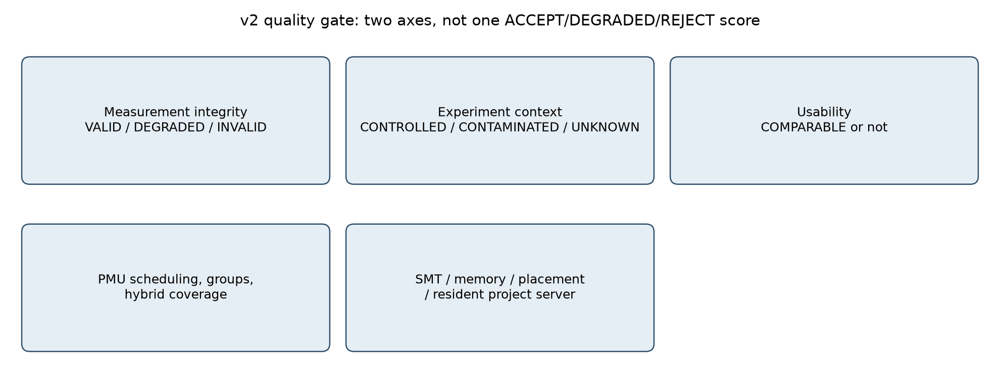
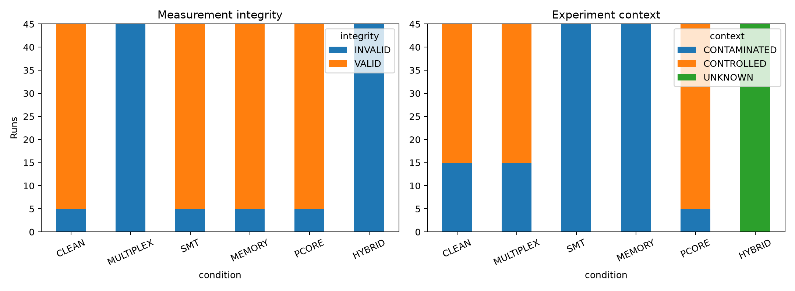
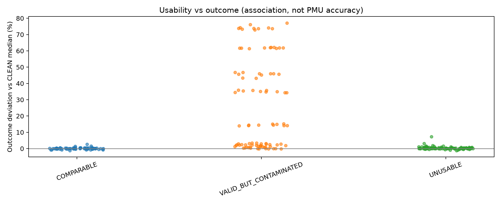
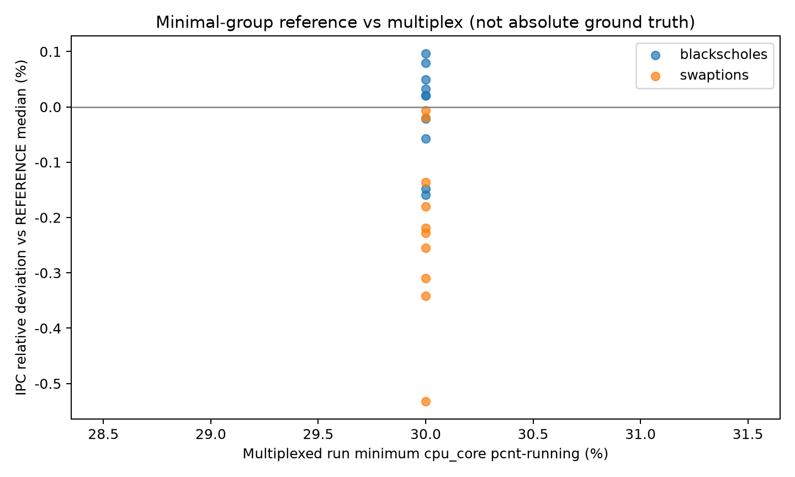

# CounterBouncer results

Current campaigns: `native-holdout-v2` and `native-cloudsuite-v2.1`.
v1 is a retrospective at the end. Numbers come from local
`artifacts/`. There is no classification accuracy and no PMU
absolute-error rate. There is no "improvement rate" either.

---

## 1. Summary

The gate has two axes. Measurement integrity is whether the counters
were collected as a technical matter. Experiment context is whether
that run is comparable. The one-word `ACCEPT` / `DEGRADED` /
`REJECT` collapses the two.

`native-holdout-v2` is four PARSEC native apps plus CloudSuite Data
Caching, 270 runs, i9-14900K bare metal. Warmups separate. Zero
launch failures. Audit PASS. Integrity: VALID 160, INVALID 110.
Context: CONTROLLED 100, CONTAMINATED 125, UNKNOWN 45. Collapsed
verdict: ACCEPT 70, DEGRADED 90, REJECT 110.

45 runs per condition. All 5 REJECT are CloudSuite. PARSEC
MULTIPLEX runtime is almost CLEAN, integrity INVALID.
`pcnt-running` median 30%. REFERENCE IPC: blackscholes +0.02%,
swaptions -0.22%. INVALID means coverage missed the bar, not a
proof that IPC is wrong.

All 30 v2 CloudSuite runs are INVALID: server threads left the pin.
Those 30 stay in the record. `native-cloudsuite-v2.1` pins threads
and adds CLEAN x5 / MEMORY x5. Policy is unchanged. CLEAN is 5/5
VALID/CONTROLLED; MEMORY is 5/5 VALID/CONTAMINATED. MEMORY p99 is
+36.2% vs CLEAN 0.0221 ms.

---

## 2. Structure

| Measurement integrity | Experiment context | Use |
|---|---|---|
| VALID | CONTROLLED | diagnosis and comparison |
| VALID | CONTAMINATED | measurement holds; compare with care |
| INVALID | (any) | do not diagnose from it |

INVALID collapses to REJECT. VALID and CONTROLLED collapse to
ACCEPT. Everything else is DEGRADED.

Migrations inside the pin do not, by themselves, drop integrity.
Affinity escape, P/E movement, and NUMA movement are tracked
separately. PCORE is `0-15`. HYBRID is every present CPU. REFERENCE
is the minimal group `{cpu_core/cycles, cpu_core/instructions}`.
Not ground truth.

| Item | Value |
|---|---|
| Host | `gpuidblab`, bare-metal, i9-14900K, 32 logical CPU, SMT on |
| Pin | P-core `2,4,6,8`. SMT interference `3,5,7,9`. Memory `24,25,26,27` |
| Policy | `configs/experiment_v2.yaml`, frozen before holdout |
| runtime CV degrade | 0.5086. 3x CLEAN kernel `cache-large` CV 0.1695 |
| latency CV | 0.10 / 0.25, written before freeze |

Pin and events: [methodology.md](methodology.md).

---

## 3. Current results

Experiment ID `native-holdout-v2`. Machine audit
`completion-audit-native-holdout-v2.json` -> **PASS** (270 runs,
issues 0). Numbers: `report-native-holdout-v2.json`.

Project CloudSuite containers were stopped before PARSEC CLEAN.

| Condition | ACCEPT | DEGRADED | REJECT |
|---|---:|---:|---:|
| CLEAN | 30 | 10 | 5 |
| MULTIPLEX | 0 | 0 | 45 |
| SMT | 0 | 40 | 5 |
| MEMORY | 0 | 40 | 5 |
| PCORE | 40 | 0 | 5 |
| HYBRID | 0 | 0 | 45 |

freqmine CLEAN x10 is VALID but CONTAMINATED (CPU `0`). On PCORE
(`0-15`) it is ACCEPT.

Minimum `cpu_core` `pcnt-running` median: CLEAN/SMT/MEMORY/PCORE
100%, MULTIPLEX 30%, PARSEC HYBRID 99%, CloudSuite HYBRID 0%.

PARSEC median runtime (seconds). Deltas vs that workload's CLEAN
median.

| Workload | CLEAN | MULTIPLEX | SMT | MEMORY | PCORE | HYBRID |
|---|---:|---:|---:|---:|---:|---:|
| blackscholes | 12.95 s | +0.4% | **+45.8%** | +2.2% | -0.0% | +0.3% |
| canneal | 40.57 s | +0.2% | +14.4% | **+73.8%** | -0.4% | -0.4% |
| freqmine | 50.83 s | +0.4% | +35.1% | +2.9% | +0.1% | +0.2% |
| swaptions | 15.62 s | +0.8% | +61.8% | +1.4% | +0.5% | +0.5% |

CloudSuite Data Caching (fixed 100,000 req/s):

| Condition | Median throughput | Throughput CV | Median interval-p99 | p99 vs CLEAN |
|---|---:|---:|---:|---:|
| CLEAN | 100021.4 | 0.00% | 0.0221 ms | - |
| MULTIPLEX | 100022.6 | 0.00% | 0.0251 ms | +13.6% |
| SMT | 100022.1 | 0.83% | 0.0271 ms | +22.6% |
| MEMORY | 100027.4 | 0.00% | 0.0301 ms | +36.2% |
| PCORE | 100022.3 | 0.00% | 0.0231 ms | +4.5% |
| HYBRID | 100022.5 | 0.00% | 0.0471 ms | **+113.1%** |

Association, not a claim that the gate catches every interference.

### 3.1 native-cloudsuite-v2.1

The 30 v2 CloudSuite runs stay. After pinning server threads, CLEAN
x5 and MEMORY x5 were added. Policy unchanged. Audit PASS. Observed
CPUs: `2,4,6,8`.

| Condition | Integrity | Context | Collapsed | p99 |
|---|---|---|---|---|
| CLEAN | VALID 5/5 | CONTROLLED | ACCEPT | 0.0221 ms |
| MEMORY | VALID 5/5 | CONTAMINATED | DEGRADED | 0.0301 ms (**+36.2%**) |

---

## 4. REFERENCE

`native-reference-v2` 40 runs, same audit PASS. Numbers:
`reference-v2.json`.

MULTIPLEX vs REFERENCE IPC: blackscholes +0.02%, swaptions -0.22%
(`pcnt-running` 30%). Close values are not enough coverage. Miss the
frozen coverage bar and the run is INVALID.

---

## 5. Limitations

One shared bare-metal box. CLEAN is not dedicated. On HYBRID,
`cpu_core` does not count E-core time. The loadtester `timeDiff`
quirk is left as recorded. Runtime CV degrade 0.5086 did not attach
`HIGH_RUN_VARIANCE`. Frequency and turbo were left alone.
`pcnt-running` cutoffs are heuristics.

v2 holdout has `git_dirty` true. No snapshot of that dirty tree.
Local `artifacts/experiment-code.patch` reconstructs the recorded
HEAD against a later committed tree.

Fuller list: [limitations.md](limitations.md).

---

## 6. Reproduce

Policy is `configs/experiment_v2.yaml`. It was not changed after
holdout. Steps: [experiments/README.md](../experiments/README.md).
Aggregate JSON, CSV, raw `perf.jsonl`, and audit files are not in
git; they live under local `artifacts/`.

`bouncer run` in this tree drives calibration kernels only. It is
not a wrap-any-command CLI.

---

## 7. v1 retrospective

v1 collapsed quality into one word `ACCEPT` / `DEGRADED` /
`REJECT`. The hypothesis was that migrations inside the pin also
hurt measurement quality.

Experiment ID `native-holdout-v1`. Machine audit
`completion-audit.json` -> **PASS** (225 runs, issues 0). Numbers:
`report.json` and raw `perf.jsonl`.

| Item | Measured |
|---|---|
| Holdout | 225 runs (PARSEC 200 + CloudSuite 25). Warmups separate. Zero launch failures |
| Collapsed verdict | ACCEPT 15, DEGRADED 160, REJECT 50 |
| CLEAN | all 45 DEGRADED (`CPU_MIGRATION`) |
| MULTIPLEX | all 45 REJECT. Min `pcnt-running` median 30% |
| Where ACCEPT appeared | blackscholes SMT x9, blackscholes MEMORY x6 only |

MULTIPLEX runtime is almost unchanged; the measurement is REJECT.
blackscholes SMT can be ACCEPT and still +45.3% median runtime vs
CLEAN. CloudSuite interval-p99 on UNPINNED is +121.7% vs CLEAN.

### 7.1 Why it failed

One word mixed two things. Movement inside the pin is run context,
not counter scheduling. SMT has PMU running 100% and still stretches
application time. UNPINNED lumped P-core and E-core into one
condition.

### 7.2 What changed

Integrity and context were split. Migrations inside the pin no
longer drop integrity. UNPINNED became PCORE and HYBRID. CloudSuite
group spread is interval-p99. Policy was frozen again in
`experiment_v2.yaml`. The 225 v1 runs stay.

### 7.3 Environment

| Item | Value |
|---|---|
| Host | `gpuidblab`, systemd-detect-virt `none` (bare-metal) |
| CPU | Intel Core i9-14900K, 32 logical CPU, SMT on, NUMA 1 |
| Pinning | P-core `2,4,6,8` (UNPINNED 0-31) |
| SMT interference | real calibration process on siblings `3,5,7,9` |
| Memory interference | real STREAM-like process on `24,25,26,27` |
| OS / perf | Linux 7.0.0-28-generic, Python 3.12.3, `perf stat -j` |
| Permission | first probe `perf_event_paranoid=4` -> BLOCKER A. Set to 1, recheck. First probe kept under local `artifacts/preflight/` |
| Shared host | leftover Docker work. CloudSuite memcached stayed up during PARSEC holdout. CLEAN means CounterBouncer added no extra load. Not a dedicated machine |

### 7.4 Method

| Suite | Workload | Input / setup | Repeats |
|---|---|---|---|
| PARSEC 3.0 | blackscholes, canneal, dedup, streamcluster | native, 4 threads, whole application (I/O included) | 10 per condition + 1 warmup |
| CloudSuite | data-caching | Twitter 28x, memcached 10 GB / 4 threads, client 8 threads, 200 conn, 100,000 req/s, timeout 60 s | 5 per condition + 1 warmup |

PARSEC is the binary itself. CloudSuite PMU is the server host PID.
Condition order is shuffled inside each repetition block. Labels
come from the manifest; good/bad was not hand-coded.

| Condition | What it is |
|---|---|
| CLEAN | pin, no extra CounterBouncer load |
| MULTIPLEX | more events, real time multiplexing |
| SMT | competing process on pinned-core siblings |
| MEMORY | memory kernel on other CPUs |
| UNPINNED | affinity removed. hybrid `cpu_core` cannot count E-core time |

Optional condition E5 (frequency/power) was not run.

Calibration: 80 runs, then freeze. Holdout did not retune.

| Rule | Value | Note |
|---|---|---|
| PMU running DEGRADED / REJECT | 90% / 50% | candidate heuristic, not a standard |
| Any `cpu-migrations` | DEGRADED | includes movement inside the 4-CPU pin |
| CV DEGRADED / REJECT | 0.05115 / 0.20 | `max(0.05, 3x max CLEAN calibration CV)` |
| Group spread | `HIGH_RUN_VARIANCE` | separate from per-run hard verdict |

Sanity check (CLEAN calibration median, `cpu_core`):

- branch-misses: predictable 8,192.0 vs random 62,800,383.5
- cache-misses: small working set 6,074.5 vs large 29,648,199.5

Official STREAM C ran only as a pipeline check after freeze. Not in
real-app results.

### 7.5 Holdout results

45 runs per condition (PARSEC 40 + CloudSuite 5).

| Condition | ACCEPT | DEGRADED | REJECT |
|---|---:|---:|---:|
| CLEAN | 0 | 45 | 0 |
| MULTIPLEX | 0 | 0 | 45 |
| SMT | 9 | 36 | 0 |
| MEMORY | 6 | 39 | 0 |
| UNPINNED | 0 | 40 | 5 |

All 5 UNPINNED REJECT are CloudSuite (`PARTIAL_HYBRID_PMU_COVERAGE`
plus scheduling-coverage issues). All 15 ACCEPT are blackscholes.

Reason codes (several can attach to one run):
`LOW_PMU_RUNNING_RATIO` 300, `CPU_MIGRATION` 210,
`PARTIAL_HYBRID_PMU_COVERAGE` 45, `HIGH_RUN_VARIANCE` 20.

`HIGH_RUN_VARIANCE` attached to four CloudSuite conditions
(CLEAN/MEMORY/SMT/UNPINNED) whose interval-p99 group CV crossed a
fixed heuristic. Throughput CV is 0.00%. Using the runtime CV cutoff
on latency is a limitation.

Minimum `cpu_core` `pcnt-running`:

| Condition | Median | Min |
|---|---:|---:|
| CLEAN | 100% | 100% |
| SMT | 100% | 100% |
| MEMORY | 100% | 100% |
| MULTIPLEX | 30% | 30% |
| UNPINNED | 99% | 0% |

MULTIPLEX is real multiplexing from more requested events. Numbers
were not spliced into the JSON.

PARSEC median runtime (seconds). Deltas vs that workload's CLEAN
median.

| Workload | CLEAN | MULTIPLEX | SMT | MEMORY | UNPINNED |
|---|---:|---:|---:|---:|---:|
| blackscholes | 12.94 s | +0.8% | **+45.3%** | +0.9% | +0.5% |
| canneal | 43.10 s | +1.0% | +13.6% | **+69.5%** | -0.6% |
| dedup | 5.63 s | 0.0% | +35.6% | +7.2% | -13.4% |
| streamcluster | 74.59 s | -1.3% | -4.8% | +27.9% | +0.2% |

Repeat CV (sample sd/mean): canneal CLEAN is highest at 4.10%. The
rest sit below. No PARSEC runtime group crossed the gate CV
DEGRADED cut (5.115%).

CloudSuite Data Caching (fixed 100,000 req/s, 53 intervals/run,
first 2 dropped):

| Condition | Median throughput (req/s) | Throughput CV | Median interval-p99 (ms) | p99 vs CLEAN |
|---|---:|---:|---:|---:|
| CLEAN | 100022.0 | 0.00% | 0.02210 | - |
| MULTIPLEX | 100022.0 | 0.00% | 0.02410 | +9.0% |
| SMT | 100022.3 | 0.00% | 0.02810 | +27.1% |
| MEMORY | 100028.7 | 0.00% | 0.03310 | +49.8% |
| UNPINNED | 100022.5 | 0.00% | 0.04900 | **+121.7%** |

Reported p99 is the across-repeat median of interval p99.

### 7.6 Azure external data

Azure VM Noise Dataset 2024: 776 CSV partitions, 7,037,220
observations, invalid 0, long/short matched 364 pairs.

Median CV on matched partitions: long-lived 0.033, short-lived
0.059.

Not local PMU ground truth. Not used to compute CounterBouncer
verdict accuracy. External context only: long-running cloud
benchmarks move too.

### 7.7 Failures and stops

| Event | Action |
|---|---|
| `perf_event_paranoid=4`, 9 default events permission-fail | stop as BLOCKER A, set permission, recheck READY. First probe kept under local `artifacts/preflight/` |
| Calibration overlapped CloudSuite sanity | drop that batch, keep `artifacts/calibration-development-overlap`, collect a separate 80, then freeze |
| CloudSuite non-TTY buffering | `docker exec -t` so official loader stats survive |
| Session end left `parsec-canneal-unpinned-r02` unfinished | excluded from measurement, kept in `artifacts/interrupted/`, retried |
| 15 s CloudSuite ran right after PARSEC exit | 15 s holdout dropped after the 60 s amendment. Kept in `artifacts/interrupted/cloudsuite-15s-before-amendment`. 60 s warmup has 53 intervals |

No holdout run was discarded for a launch failure.

---

## Sources

[sources.md](sources.md). Azure: Freischuetz, Kanellis, Kroth,
Venkataraman, *TUNA*, EuroSys 2025, CC-BY.
