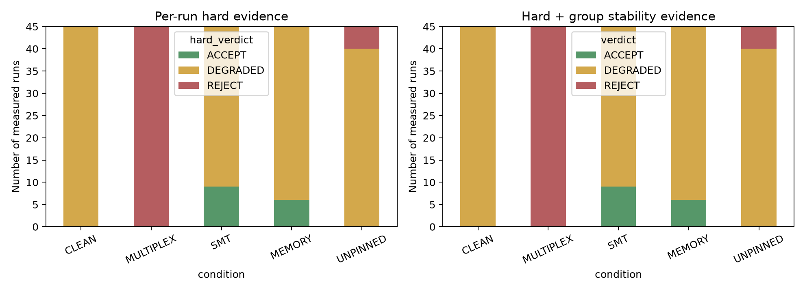
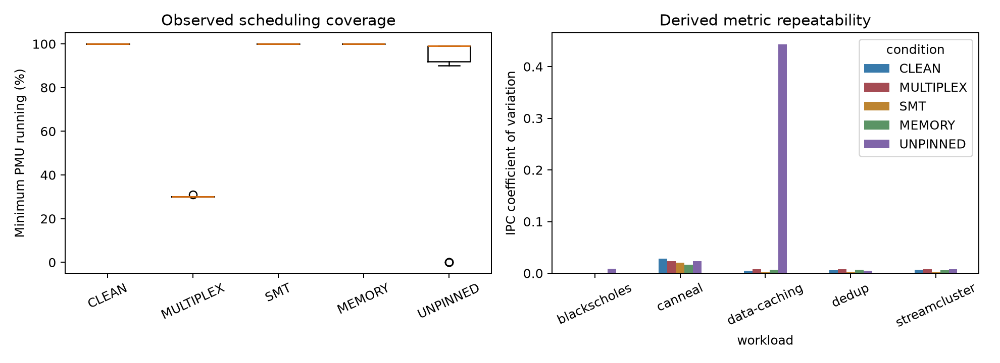
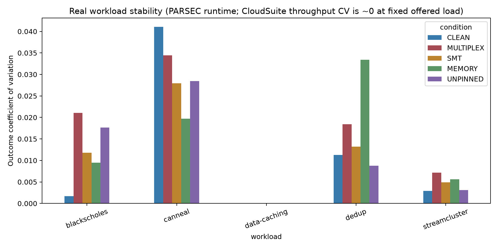
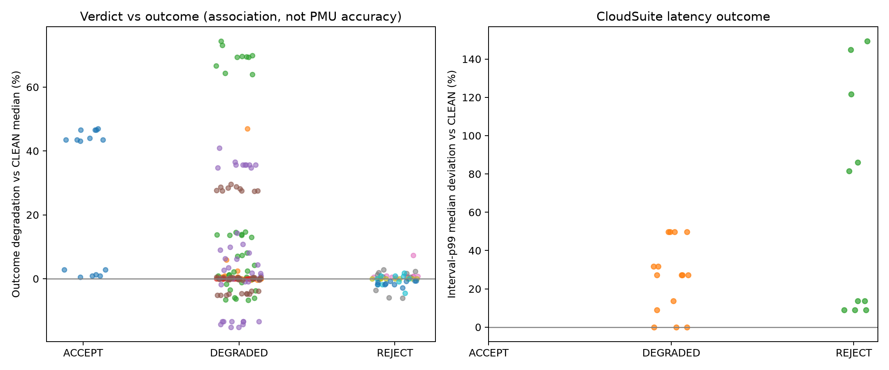
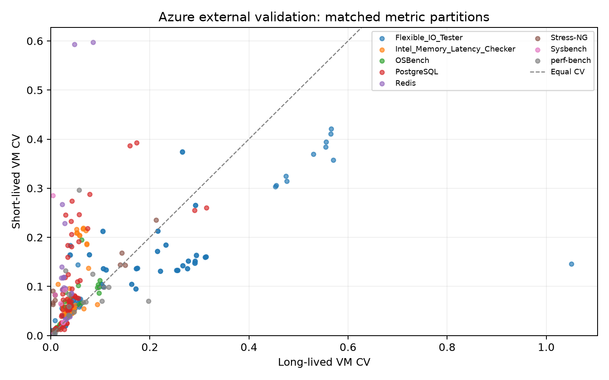

# CounterBouncer 결과 보고서

- 실험 ID: `native-holdout-v1`
- 기계 감사: 로컬 `artifacts/completion-audit.json` → **PASS** (225회, 문제 0). 이 파일은 git에 없습니다.
- 숫자는 로컬 `artifacts/analysis/report.json`과 원시 `perf.jsonl`에서만 가져왔습니다. 분류 정확도, PMU 절대 오차율, 측정하지 않은 개선율은 없습니다.

---

## 1. 요약

Linux PMU 측정이 성능 진단에 쓸 수 있는 품질인지
`ACCEPT / DEGRADED / REJECT`로 판정하는 quality gate를 PARSEC native
4종과 CloudSuite Data Caching으로 검증했습니다.

| 항목 | 실측 |
|---|---|
| Holdout | 225회 (PARSEC 200 + CloudSuite 25). warmup 별도. 실행 실패 0 |
| 최종 판정 | ACCEPT 15, DEGRADED 160, REJECT 50 |
| CLEAN | 45회 전부 DEGRADED (`CPU_MIGRATION`) |
| MULTIPLEX | 45회 전부 REJECT. 최소 `pcnt-running` 중앙값 30% |
| ACCEPT가 나온 곳 | blackscholes SMT 9회, blackscholes MEMORY 6회뿐 |

MULTIPLEX는 runtime이 거의 그대로인데 측정은 REJECT입니다.
blackscholes SMT는 품질이 ACCEPT여도 CLEAN 대비 median runtime이
+45.3%입니다. CloudSuite는 고정 offered load라 throughput CV가 0.00%이고
interval-p99는 UNPINNED에서 CLEAN 대비 +121.7%입니다.

이 관계는 연관입니다. 게이트가 모든 간섭을 탐지한다는 뜻이 아닙니다.

---

## 2. 질문과 범위 밖

질문은 “왜 느린가”가 아니라 **“이번 측정을 진단 근거로 써도 되는가”**입니다.

하지 않은 것: profiler, dashboard, LLM 병목 진단, CXL/accelerator
counter, 임의 생성 성능값, “정확도 95%”처럼 정의되지 않은 지표.

---

## 3. 실험 환경

| 항목 | 값 |
|---|---|
| Host | `gpuidblab`, systemd-detect-virt `none` (bare-metal) |
| CPU | Intel Core i9-14900K, 32 logical CPU, SMT on, NUMA 1 |
| Pinning | P-core `2,4,6,8` (UNPINNED는 0–31) |
| SMT 간섭 | sibling `3,5,7,9`에서 실제 calibration process |
| Memory 간섭 | `24,25,26,27`에서 실제 STREAM-like process |
| OS / perf | Linux 7.0.0-28-generic, Python 3.12.3, `perf stat -j` |
| 권한 | 최초 `perf_event_paranoid=4`로 BLOCKER A. 임시로 1 설정 후 재검사. 최초 probe는 로컬 `artifacts/preflight/`에 보존 |
| 공유 호스트 | 기존 Docker 워크로드 잔류. PARSEC holdout 동안 CloudSuite memcached도 상주. CLEAN은 CounterBouncer 추가 간섭이 없다는 뜻이지 전용 머신이 아니다 |

상세는 로컬 `artifacts/preflight/authorized/system.json`과
[방법](methodology.md)입니다.

---

## 4. 방법

### 4.1 Workload

| Suite | Workload | Input / 설정 | 반복 |
|---|---|---|---|
| PARSEC 3.0 | blackscholes, canneal, dedup, streamcluster | native, 4 threads, whole application (I/O 포함) | 조건당 10회 + warmup 1 |
| CloudSuite | data-caching | Twitter 28×, memcached 10 GB / 4 threads, client 8 threads, 200 conn, 100,000 req/s, timeout 60 s | 조건당 5회 + warmup 1 |

PARSEC는 직접 바이너리, CloudSuite PMU는 서버 host PID입니다. 조건
순서는 repetition block 안에서 무작위화했습니다. 라벨은 manifest에서
생성했고 손으로 good/bad를 넣지 않았습니다.

### 4.2 조건

| 조건 | 내용 |
|---|---|
| CLEAN | pin, CounterBouncer 추가 부하 없음 |
| MULTIPLEX | 실제 event 수를 늘려 time multiplexing 유도 |
| SMT | pin된 코어의 sibling에서 실제 competing process |
| MEMORY | 별도 CPU에서 실제 memory kernel |
| UNPINNED | affinity 제거. hybrid `cpu_core`는 E-core 시간을 못 셈 |

선택 조건 E5(frequency/power)는 하지 않았습니다.

### 4.3 판정 정책 (holdout 전 freeze)

Calibration 80회 수집 후 정책을 고정했습니다. holdout을 본 뒤
재튜닝하지 않았습니다.

| 규칙 | 값 | 비고 |
|---|---|---|
| PMU running DEGRADED / REJECT | 90% / 50% | 후보 heuristic, 업계 표준 아님 |
| 임의 `cpu-migrations` | DEGRADED | 4-CPU pin 안 이동도 포함 |
| CV DEGRADED / REJECT | 0.05115 / 0.20 | `max(0.05, 3× max CLEAN calibration CV)` |
| 그룹 분산 | `HIGH_RUN_VARIANCE` | per-run hard verdict와 분리 |

정성 확인 (CLEAN calibration 중앙값, `cpu_core`):

- branch-misses: predictable 8,192.0 vs random 62,800,383.5
- cache-misses: small working set 6,074.5 vs large 29,648,199.5

공식 STREAM C는 freeze 이후 pipeline check로만 실행했습니다. real-app
결과에 합치지 않았습니다.

---

## 5. Holdout 결과

### 5.1 판정 분포

조건당 45회 (PARSEC 40 + CloudSuite 5).

| 조건 | ACCEPT | DEGRADED | REJECT |
|---|---:|---:|---:|
| CLEAN | 0 | 45 | 0 |
| MULTIPLEX | 0 | 0 | 45 |
| SMT | 9 | 36 | 0 |
| MEMORY | 6 | 39 | 0 |
| UNPINNED | 0 | 40 | 5 |

UNPINNED REJECT 5회는 전부 CloudSuite입니다
(`PARTIAL_HYBRID_PMU_COVERAGE` 외에 스케줄링 coverage 문제). ACCEPT
15회는 모두 blackscholes입니다.

Reason code (한 run에 여러 개 가능): `LOW_PMU_RUNNING_RATIO` 300,
`CPU_MIGRATION` 210, `PARTIAL_HYBRID_PMU_COVERAGE` 45,
`HIGH_RUN_VARIANCE` 20.

`HIGH_RUN_VARIANCE`는 CloudSuite interval-p99 그룹 CV가 고정 heuristic을
넘긴 4개 조건(CLEAN/MEMORY/SMT/UNPINNED)에 붙었습니다. throughput CV는
0.00%입니다. 런타임 기준으로 잡은 CV를 latency에 그대로 쓴 것은
한계로 남깁니다.

### 5.2 PMU scheduling

최소 `cpu_core` `pcnt-running`:

| 조건 | 중앙값 | 최소 |
|---|---:|---:|
| CLEAN | 100% | 100% |
| SMT | 100% | 100% |
| MEMORY | 100% | 100% |
| MULTIPLEX | 30% | 30% |
| UNPINNED | 99% | 0% |

MULTIPLEX는 요청 event가 늘어난 실제 multiplexing입니다. 값을 JSON에
넣은 것이 아닙니다.

### 5.3 애플리케이션 측정 (CLEAN median 대비)

PARSEC median runtime (초). 변화율은 해당 workload CLEAN median 대비.

| Workload | CLEAN | MULTIPLEX | SMT | MEMORY | UNPINNED |
|---|---:|---:|---:|---:|---:|
| blackscholes | 12.94 s | +0.8% | **+45.3%** | +0.9% | +0.5% |
| canneal | 43.10 s | +1.0% | +13.6% | **+69.5%** | −0.6% |
| dedup | 5.63 s | 0.0% | +35.6% | +7.2% | −13.4% |
| streamcluster | 74.59 s | −1.3% | −4.8% | +27.9% | +0.2% |

반복 CV (표본 표준편차/평균): canneal CLEAN이 4.10%로 가장 높습니다.
나머지는 대개 그 아래입니다. 게이트 CV DEGRADED 컷(5.115%)을 PARSEC
runtime이 넘긴 그룹은 없습니다.

CloudSuite Data Caching (고정 100,000 req/s, interval 53개/run, 첫 2
interval 제외):

| 조건 | Median throughput (req/s) | Throughput CV | Median interval-p99 (ms) | p99 vs CLEAN |
|---|---:|---:|---:|---:|
| CLEAN | 100022.0 | 0.00% | 0.02210 | — |
| MULTIPLEX | 100022.0 | 0.00% | 0.02410 | +9.0% |
| SMT | 100022.3 | 0.00% | 0.02810 | +27.1% |
| MEMORY | 100028.7 | 0.00% | 0.03310 | +49.8% |
| UNPINNED | 100022.5 | 0.00% | 0.04900 | **+121.7%** |

보고된 p99는 interval p99의 반복 간 중앙값입니다. 요청 전체 pooled
p99가 아닙니다.

Figure 3에서 data-caching 막대가 안 보이는 것은 throughput CV가 0에
가깝기 때문입니다.

---

## 6. 품질 판정과 애플리케이션 측정의 관계

| 관찰 | 측정 | 해석 한계 |
|---|---|---|
| MULTIPLEX REJECT, runtime ≈ CLEAN | blackscholes +0.8%, canneal +1.0%, dedup 0.0%, streamcluster −1.3%, CloudSuite throughput 0.000% | 느리지 않아도 측정 coverage가 부족할 수 있다 |
| blackscholes SMT ACCEPT, runtime +45.3% | 9/10 ACCEPT, PMU running 100% | 스케줄링이 좋아도 sibling contention은 애플리케이션을 늘릴 수 있다 |
| CloudSuite UNPINNED REJECT, p99 +121.7% | throughput은 그대로 | 고정 load에서는 latency가 더 잘 움직인다 |
| CLEAN 전원 DEGRADED | pin 집합 내부 `cpu-migrations` | CLEAN은 실험 조건이지 “올바른 측정” 라벨이 아니다 |

게이트는 병목을 진단하지 않습니다. 위 표는 연관입니다.

---

## 7. Azure 외부 자료

Azure VM Noise Dataset 2024: 776 CSV partition, 7,037,220 observations,
invalid 0, long/short 매칭 364쌍.

매칭 partition의 median CV: long-lived 0.033, short-lived 0.059.

로컬 PMU ground truth가 아니고 CounterBouncer 판정 정확도 계산에도
쓰지 않았습니다. 장기간 cloud benchmark에도 변동이 있다는 외부 맥락만
봅니다.

---

## 8. 실패·중단 기록

| 사건 | 조치 |
|---|---|
| `perf_event_paranoid=4`, 기본 event 9개 권한 실패 | BLOCKER A로 중단 후 권한 설정, 재검사 READY. 최초 probe는 로컬 `artifacts/preflight/`에 보존 |
| Calibration이 CloudSuite sanity와 겹침 | 해당 회차 제외, `artifacts/calibration-development-overlap` 보존, 별도 80회 재수집 후 freeze |
| CloudSuite 비TTY 버퍼링 | `docker exec -t`로 공식 loader 통계 보존 |
| 세션 종료로 `parsec-canneal-unpinned-r02` 미완료 | 측정으로 채택하지 않음. `artifacts/interrupted/`에 보존 후 재시도 |
| PARSEC 종료 직후 15 s CloudSuite가 잠깐 실행됨 | 60 s로 개정한 뒤라 15 s holdout은 제외. `artifacts/interrupted/cloudsuite-15s-before-amendment` 보존. 60 s warmup은 interval 53개 |

실행 실패로 버린 holdout run은 없습니다.

---

## 9. 한계

- 공유 bare-metal 1대. 주파수/터보 미고정. E5 없음.
- `cpu_core`는 UNPINNED의 E-core 시간을 포함하지 않습니다. IPC를 PMU 간에 합산하지 않았습니다.
- generic cache event를 다른 CPU에도 통하는 LLC/bandwidth라고 주장하지 않습니다.
- PARSEC는 hook ROI가 아니라 프로세스 전체 시간입니다.
- CloudSuite는 단일 호스트 Docker bridge, 고정 offered load입니다.
- threshold는 heuristic입니다. 이 호스트·이 반복 수 밖의 일반 정확도를 주장하지 않습니다.

전체 목록: [limitations.md](limitations.md).

---

## 10. 결론

실제 애플리케이션 225회에서, 요청 event가 늘어나면 `pcnt-running`이
약 30%로 떨어졌고 해당 측정은 전부 REJECT였습니다. 같은 조건에서
애플리케이션 runtime은 거의 늘지 않았습니다.

pin과 warmup이 있는 CLEAN도 이 호스트에서는 `cpu-migrations` 때문에
DEGRADED가 기본이었습니다. “깨끗한 조건”과 “ACCEPT”를 같은 말로 쓰지
않습니다.

SMT/memory contention은 워크로드에 따라 runtime 또는 p99를 바꿨고
그때 PMU running이 100%인 경우(blackscholes SMT)도 있었습니다.

CounterBouncer가 내는 것은 “느린 원인”이 아니라 이번 측정을 진단에
넣어도 되는지와 그 근거 코드입니다.

하지 않은 주장: PMU 오류 완벽 탐지, 모든 CPU에서 동일 의미의
cache/bandwidth metric, CXL 성능, 정의되지 않은 정확도.

---

## 11. 재현

정책 파일 `configs/experiment.yaml`은 freeze 이후 바꾸지 않습니다.
절차는 [experiments/README.md](../experiments/README.md).

원시 표는 로컬 `artifacts/analysis/report.json`,
`artifacts/analysis/runs.csv`에 있습니다. 파이프라인 그림은
[Figure 1](figures/figure1_architecture.png).

---

## 출처

[sources.md](sources.md). Azure: Freischuetz, Kanellis, Kroth,
Venkataraman, *TUNA*, EuroSys 2025, CC-BY.
